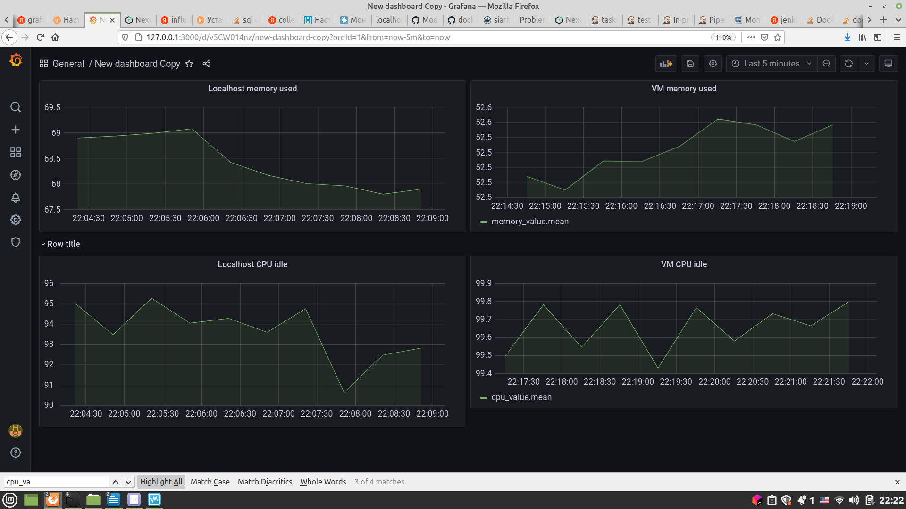
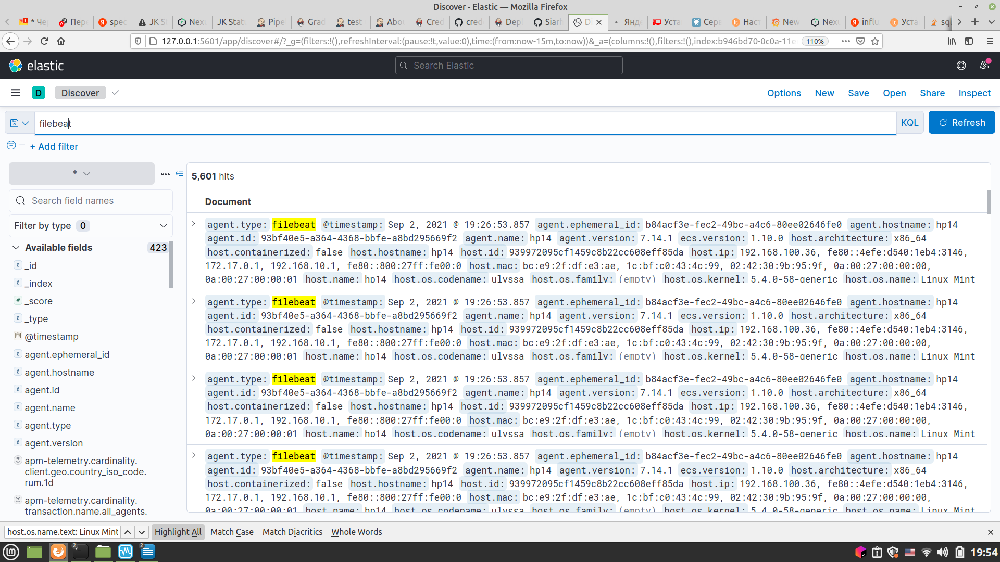

# Module_7
***
The module consists of **2 parts**:
1. Graphical monitoring stack (**Collectd, Influxdb, Grafana**)(see. *graphs* directory):  
    a) **InfluxDB and Grafana** must be started by **docker-compose** in containers, **Collectd** must be started on machine which metrics we are going to collect.  
    b) As a **result** of this stack usage we can receive such graphs:
    

2. Logs monitoring stack (**Elasticsearch, Logstash, Kibana, Filebeat**)(see. *logs* directory):  
    a) **Elasticsearch, Logstash, Kibana** must be started by **docker-compose** in containers, **Filebeat** must be started on machine which logs we are going to collect.  
    b) As a **result** of this stack usage we can receive such view of collected logs:
  
